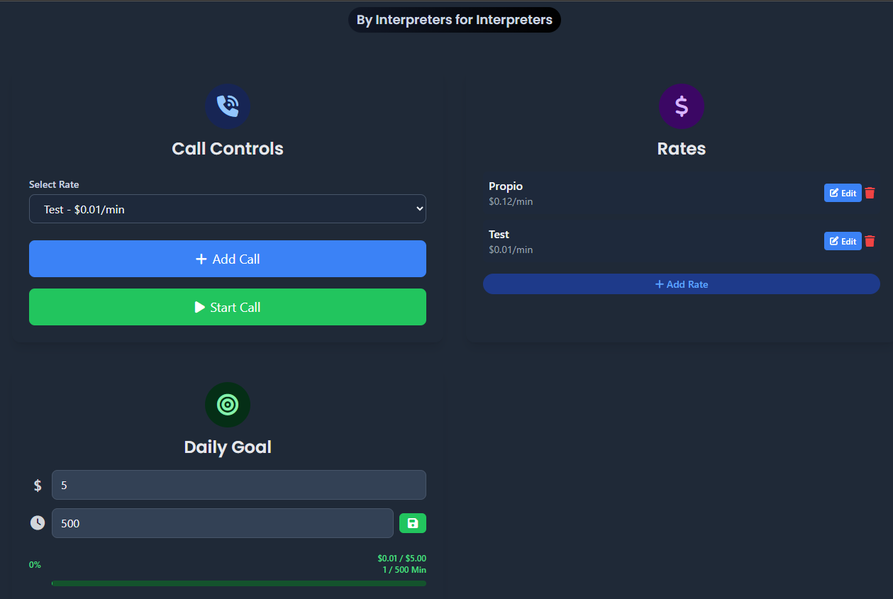
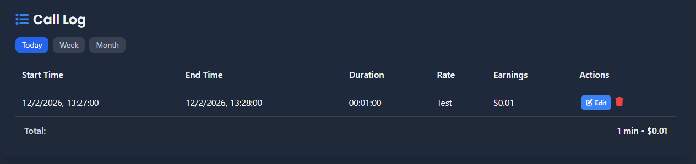
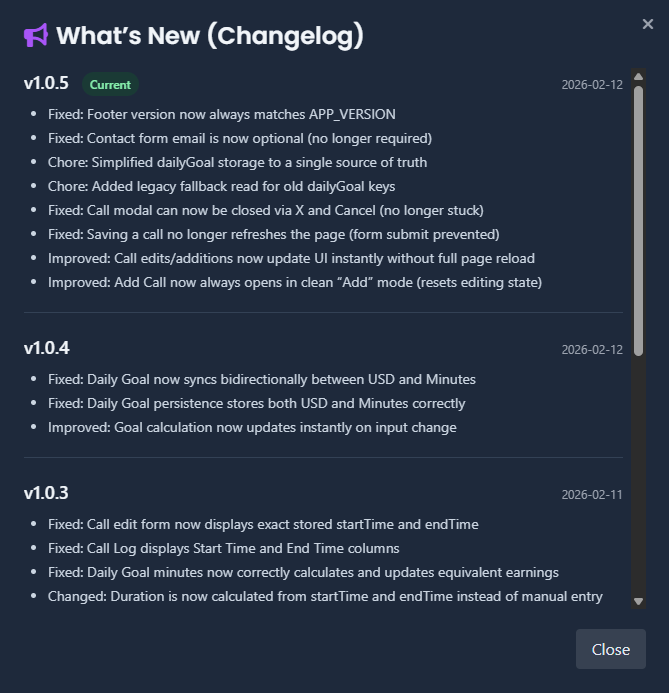

# Work Time Tracker


A lightweight, privacy-first time tracker for interpreters and freelancers.

Track live calls, earnings, rates, goals, and payment cycles directly in your browser.

## Table of Contents
- [Live Demo](#live-demo)
- [Who This Is For](#who-this-is-for)
- [Key Workflows](#key-workflows)
- [Screenshots](#screenshots)
- [Core Features](#core-features)
- [Data \& Privacy](#data--privacy)
- [Security Notes](#security-notes)
- [Backup \& Restore](#backup--restore)
- [Limitations](#limitations)
- [Browser Support](#browser-support)
- [Quick Start](#quick-start)
- [Tech Stack](#tech-stack)
- [Project Structure](#project-structure)
- [Contributing](#contributing)
- [FAQ](#faq)
- [Release Notes](#release-notes)
- [Feedback](#feedback)
- [Credits](#credits)

## Live Demo
- https://untopo.github.io/work-time-tracker/

## Who This Is For
- Interpreters who bill by call duration.
- Freelancers tracking time-based income without spreadsheets.
- Users who prefer a fast, local-only tool with no account setup.

## Key Workflows
1. Select a rate and start a live call.
2. End the call and automatically save duration + earnings.
3. Review totals in stats and call log filters.
4. Export JSON backup regularly from Settings.

## Screenshots
### Dashboard


### Call Log


### What's New


## Core Features
- Live call timer with real-time earnings
- Manual call entry + call editing
- Multiple billing rates
- Call filters: Today / Week / Month / Custom date
- Daily goal tracking (USD and minutes sync)
- Monthly stats + optional payment cycle tracking
- Floating call controls (optional)
- Optional volatile notes (never persisted/exported)
- Built-in changelog modal

## Data & Privacy
- 100% local `localStorage`
- No accounts
- No tracking
- No analytics
- No backend
- No cloud sync
- Notes are volatile by design

## Security Notes
- Data stays in your browser only.
- If browser storage is cleared, your data is permanently removed.
- Use export backups if your tracking data is important.

## Backup & Restore
- Export: `Settings -> Data Management -> Export Data`
- Import: `Settings -> Data Management -> Import Data`
- Reset calls only: `Settings -> Data Management -> Reset Calls Only`
- Full reset: `Settings -> Data Management -> Reset All Data`

## Limitations
- No multi-device sync (single browser profile only).
- No cloud recovery.
- localStorage capacity depends on browser/device limits.
- Clearing site data or using private/incognito sessions may remove data.

## Browser Support
Tested and recommended on latest:
- Chrome
- Edge
- Firefox

Safari generally works, but always verify export/import behavior on your environment.

## Quick Start
```bash
git clone https://github.com/untopo/work-time-tracker.git
```
Open `index.html` in your browser.

No build step required.

## Tech Stack
- Vanilla JavaScript (ES6)
- HTML + CSS
- GitHub Pages compatible
- Feature flags for progressive rollout

## Project Structure
```text
/
|-- index.html
|-- assets/
|   |-- css/
|   |   `-- styles.css
|   |-- js/
|   |   `-- app.js
|   `-- images/
|-- README.md
`-- .nojekyll
```

## Contributing
1. Fork and create a branch.
2. Keep changes focused and small.
3. Preserve user data behavior and modal UX consistency.
4. Open a PR with:
- What changed
- Why it changed
- Manual test notes (especially for settings/modals)

## FAQ
### Where is my data stored?
In your browser `localStorage` for this site.

### Are notes saved?
No. Notes are volatile and intentionally not persisted/exported.

### Can I sync data across devices?
Not currently. Use JSON export/import manually.

### Why did my data disappear?
Most likely browser/site storage was cleared or a private session ended.

### How do I back up safely?
Export JSON regularly from `Settings -> Data Management`.

## Release Notes
- Current Version: `v1.1.26`
- Full history is available in-app via the footer version button (`What's New` modal).

## Feedback
Use the in-app `Contact Us` modal for:
- Bug reports
- Feature requests
- General feedback

## Credits
Built for interpreters by interpreters.

Made by [Topo](https://www.instagram.com/otpo/)
