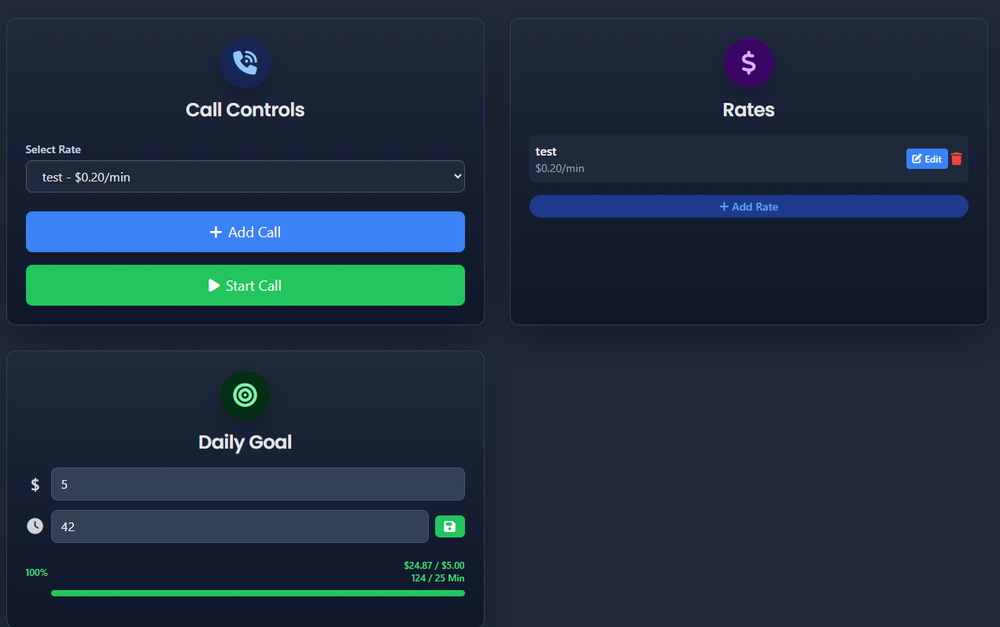
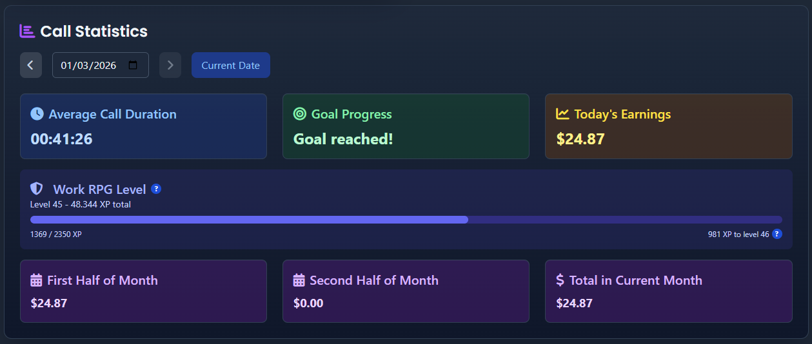
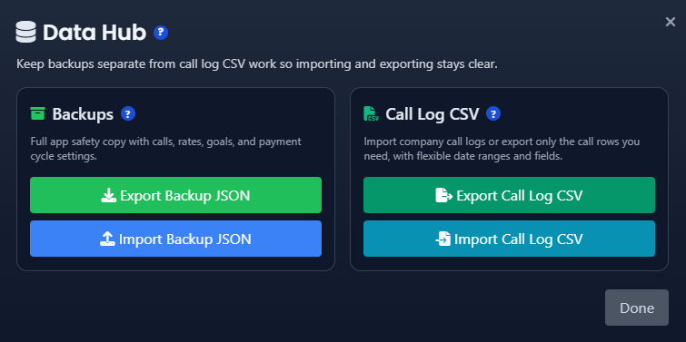
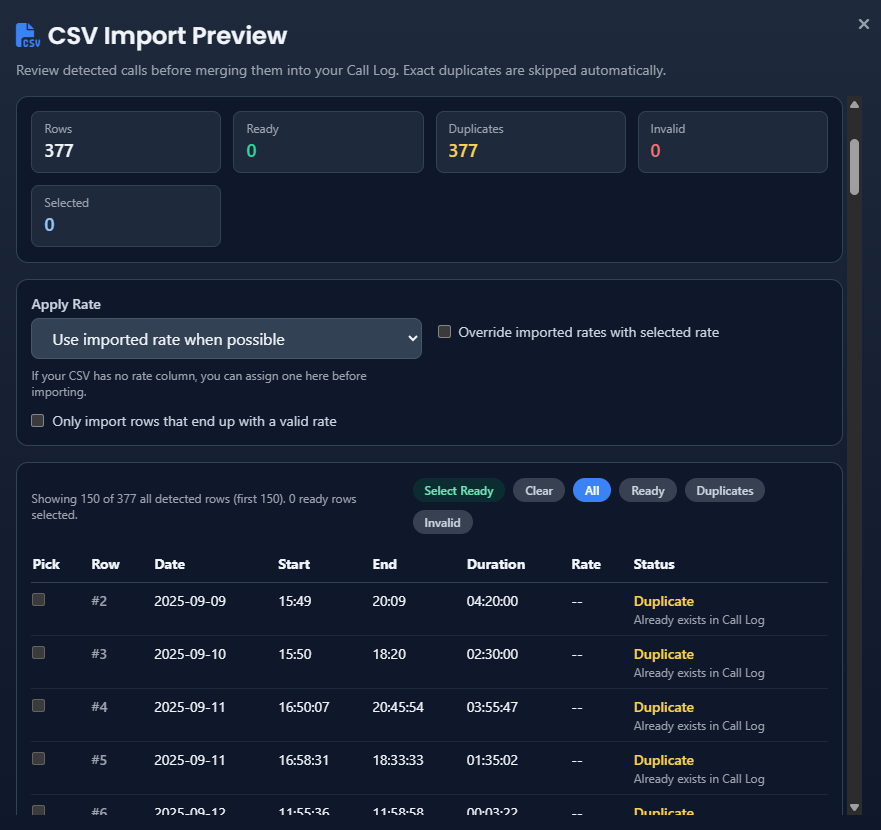
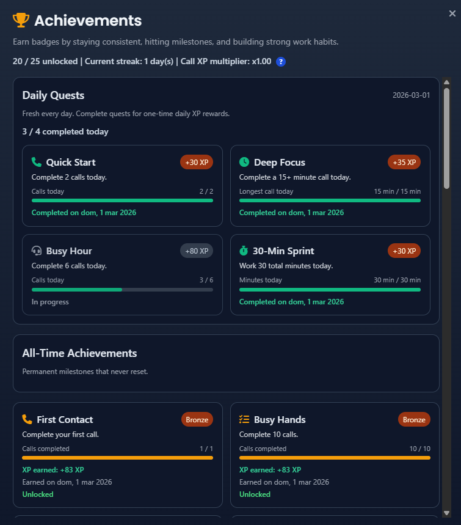

# Work Time Tracker


A lightweight, privacy-first time tracker for interpreters and freelancers.

Track live calls, earnings, rates, goals, achievements, and payment cycles directly in your browser.

## Table of Contents
- [Live Demo](#live-demo)
- [Who This Is For](#who-this-is-for)
- [Key Workflows](#key-workflows)
- [Screenshots](#screenshots)
- [Core Features](#core-features)
- [Data \& Privacy](#data--privacy)
- [Security Notes](#security-notes)
- [Backup \& Restore](#backup--restore)
- [Desktop App Prep](#desktop-app-prep)
- [Mobile App Prep](#mobile-app-prep)
- [Limitations](#limitations)
- [Browser Support](#browser-support)
- [Quick Start](#quick-start)
- [Tech Stack](#tech-stack)
- [Project Structure](#project-structure)
- [Contributing](#contributing)
- [FAQ](#faq)
- [Changelog](#changelog)
- [Feedback](#feedback)
- [Credits](#credits)

## Live Demo
- https://untopo.github.io/work-time-tracker/

## Who This Is For
- Interpreters who bill by call duration.
- Freelancers tracking time-based income without spreadsheets.
- Users who prefer a fast, local-only tool with no account setup.

## Key Workflows
1. Select a rate and start a live call.
2. End the call and automatically save duration + earnings.
3. Add manual calls with flexible date, time, and duration inputs when needed.
4. Review totals in stats, achievements, and call log filters.
5. Export backups or import JSON / CSV call logs from Settings.

## Screenshots
### Dashboard Top


### Dashboard Stats


### Data Hub


### CSV Import Preview


### Achievements


## Core Features
- Live call timer with real-time earnings
- Manual call entry + call editing
- Flexible Add Call modal with separate `Call Date`, `Start Time`, `End Time`, and `Duration`
- Duration input supports minutes (`15`) or time formats like `00:15:30`
- Multiple billing rates
- Call filters: Today / Week / Month / Custom date
- Daily goal tracking (USD and minutes sync)
- Monthly stats + optional payment cycle tracking
- Achievements system with milestone tracking
- Optional RPG Mode with XP, levels, and daily quests
- CSV call log import with preview, dedupe, and rate assignment
- Call Log CSV export for spreadsheet-friendly records
- Export scope selector for all history, current filtered view, a specific date, or a custom range
- Minimal Data Hub that separates backups from Call Log CSV actions
- Automatic restore of active live calls when reopening the app
- Desktop and mobile update notice when a newer packaged release is available
- Safe backup merge import that preserves existing local data
- Dark mode / light mode toggle
- Floating call controls (optional)
- Optional volatile notes (never persisted/exported)
- Built-in changelog modal
- Mobile-friendly Call Log cards on narrow screens

## Data & Privacy
- 100% local `localStorage`
- No accounts
- No tracking
- No analytics
- No backend
- No automatic cloud sync
- Notes are volatile by design

## Security Notes
- Data stays in your browser only.
- If browser storage is cleared, your data is permanently removed.
- Use export backups if your tracking data is important.

## Backup & Restore
- Open Data Hub: `Settings -> Data Management -> Open Data Hub`
- Export Backup JSON: `Settings -> Data Management -> Open Data Hub -> Export Backup JSON`
- Export Call Log CSV: `Settings -> Data Management -> Open Data Hub -> Export Call Log CSV`
- Import backup / CSV: `Settings -> Data Management -> Open Data Hub -> Import Backup JSON / Import Call Log CSV`
- Reset calls only: `Settings -> Data Management -> Reset Calls Only`
- Full reset: `Settings -> Data Management -> Reset All Data`

### Import Behavior
- JSON backups are merged into your current local data instead of replacing it.
- CSV imports are reviewed before saving.
- CSV preview supports filters for `Ready`, `Duplicates`, and `Invalid` rows.
- Exact duplicate calls are skipped automatically during CSV and backup merges.
- CSV preview lets you map columns for:
  - `Call Date`
  - `Start Time`
  - `End Time`
  - `Duration`
  - `Rate` (optional)
- If a CSV has no usable rate column, you can apply a rate before confirming the import.

### Export Behavior
- Both export actions now let you choose the call scope before downloading:
  - `All History`
  - `Current Call Log View`
  - `Specific Date`
  - `Custom Range`
- `Export Backup JSON` still includes rates, goals, and payment cycle settings.
- `Export Call Log CSV` exports just the selected call rows in spreadsheet format.
- CSV export also lets you choose which columns to include.

## Desktop App Prep
The project is now scaffolded to support a future Tauri desktop build from the same codebase used by GitHub Pages.

Current setup:
- Web version still runs directly from the project root
- Desktop packaging uses a generated `dist/` folder
- Tauri config lives in `src-tauri/`
- App persistence now goes through a shared storage adapter so the same frontend can target browser storage today and Tauri-native storage later
- Tauri builds now mirror app storage to a native JSON snapshot file in the app data directory while keeping the browser flow unchanged
- Tauri desktop builds now use native open/save dialogs for JSON backup import/export and CSV import/export while the browser version keeps its current download/upload flow
Important:
- Existing GitHub Pages users keep using the same browser `localStorage` keys as before, so this refactor does not wipe or rename their saved data
- The browser version and the future desktop app will not automatically share the same `localStorage`
- To move data between them safely, use `Export Backup JSON` from one side and `Import Backup JSON` on the other

What you need to install on Windows:
- Rust / Cargo
- Microsoft Visual Studio Build Tools with:
  - MSVC
  - Windows 10/11 SDK
  - Desktop development with C++

Project commands:
```bash
npm run build:web
npm run tauri:dev
npm run tauri:build
```

Notes:
- `npm run build:web` prepares the static `dist/` folder used by Tauri
- `npm run tauri:dev` launches the desktop app against the same frontend
- `npm run tauri:build` creates the installable desktop bundle once the Windows build tools are installed

## Mobile App Prep
The same repository now also includes the first Capacitor-based mobile scaffold so web, desktop, and future mobile builds can keep sharing one frontend.

Current setup:
- Capacitor config lives in `capacitor.config.json`
- Android scaffold lives in `android/`
- Mobile sync still uses the generated `dist/` frontend output
- Narrow screens now use a dedicated card-based `Call Log` layout instead of relying only on the desktop table view
- Phone-sized inputs now use safer sizing to reduce browser zoom and touch friction

Project commands:
```bash
npm run build:web
npm run cap:sync
npm run cap:sync:android
npm run cap:open:android
```

Notes:
- `npm run cap:sync` refreshes Capacitor platforms from the current shared web app
- `npm run cap:sync:android` updates the Android project specifically
- `npm run cap:open:android` opens the Android project in Android Studio once your Android toolchain is installed
- The Android scaffold is a prep step, not a published mobile release yet

## Limitations
- No multi-device sync (single browser profile only).
- No cloud recovery.
- localStorage capacity depends on browser/device limits.
- Clearing site data or using private/incognito sessions may remove data.

## Browser Support
Tested and recommended on latest:
- Chrome
- Edge
- Firefox

Safari generally works, but always verify export/import behavior on your environment.

## Quick Start
```bash
git clone https://github.com/untopo/work-time-tracker.git
```
Open `index.html` in your browser.

No build step required.

## Tech Stack
- Vanilla JavaScript (ES6)
- HTML + CSS
- GitHub Pages compatible
- Feature flags for progressive rollout

## Project Structure
```text
/
|-- index.html
|-- package.json
|-- capacitor.config.json
|-- scripts/
|   |-- prepare-dist.mjs
|   `-- tauri-win.mjs
|-- android/
|-- src-tauri/
|-- assets/
|   |-- css/
|   |   `-- styles.css
|   |-- js/
|   |   |-- app.js
|   |   `-- storage.js
|   `-- images/
|-- README.md
`-- .nojekyll
```

## Contributing
1. Fork and create a branch.
2. Keep changes focused and small.
3. Preserve user data behavior and modal UX consistency.
4. Open a PR with:
- What changed
- Why it changed
- Manual test notes (especially for settings/modals)

## FAQ
### Where is my data stored?
In your browser `localStorage` for this site.

### Are notes saved?
No. Notes are volatile and intentionally not persisted/exported.

### Can I sync data across devices?
Not currently. Use JSON export/import manually.

### Can I import a company call history CSV?
Yes. The app can import CSV files when they include the same core fields used by the Call Log:
- `Call Date`
- `Start Time`
- `End Time`
- `Duration`
- `Rate` (optional)

Before importing, the app shows a preview so you can:
- confirm detected rows
- map columns manually if needed
- assign a rate to imported calls
- skip accidental duplicates automatically

### Why did my data disappear?
Most likely browser/site storage was cleared or a private session ended.

### How do I back up safely?
Export JSON regularly from `Settings -> Data Management -> Open Data Hub`.

## Changelog
- Current Version: `v1.2.7`
- In-app history: footer version link (`What's New` modal)
- Full markdown changelog: [`CHANGELOG.md`](CHANGELOG.md)
- Published release entries and assets: [GitHub Releases](https://github.com/untopo/work-time-tracker/releases)

## Feedback
Use the in-app `Contact Us` modal for:
- Bug reports
- Feature requests
- General feedback

Direct contact reference: `worktimetrackertool@gmail.com`

## Credits
Built for interpreters by interpreters.

Made by [Topo](https://www.instagram.com/otpo/)


