# Work Time Tracker


A local-first call, earnings, and workflow tracker built for interpreters.

Run live calls, log manual work, track rates and goals, review your patterns, manage sessions, and use interpreter support tools — all in one workspace, with no accounts and no cloud sync. Your work data never leaves your device.

**[/live demo on the web](https://untopo.github.io/work-time-tracker/)**

---

## Take a Tour

### Work — your control room

Start a call and watch the timer and earnings update in real time. Rates, daily goals, and your session tracker live on the same screen, so everything you need during a live call is one glance away.

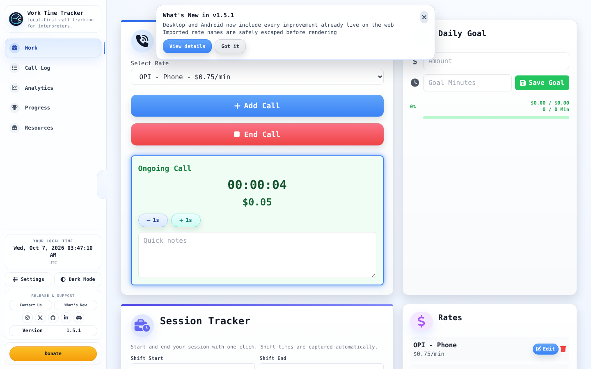

- Start and end live calls with real-time timer and earnings
- Manage multiple billing rates and daily goals in USD and minutes
- Run work sessions with pause/resume and utilization metrics
- Log manual calls when the call is already over

When a call ends, a quick review strip lets you double-check the entry before moving on.

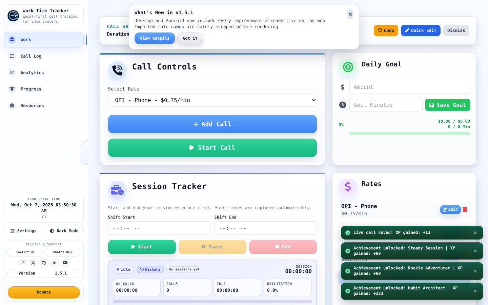

### Focus Mode — optional, one tap

During a live call, tap **Focus** to blur the workspace and center what matters: a big live timer, real-time earnings, and a ring that fills as you approach your daily goal. Exit anytime — with the button or the Esc key — without touching the call. Prefer the classic view? Turn Focus Mode off in `Settings -> Features`.

| Light | Dark |
|:---:|:---:|
| 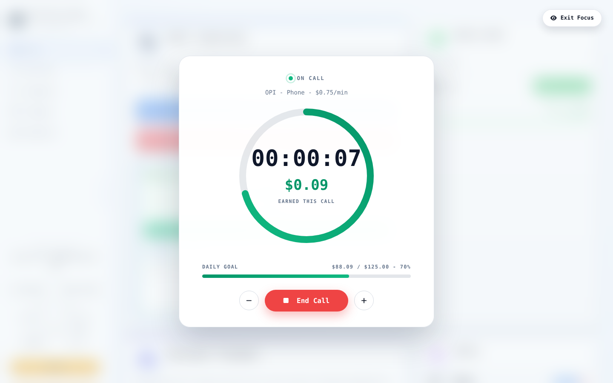 | 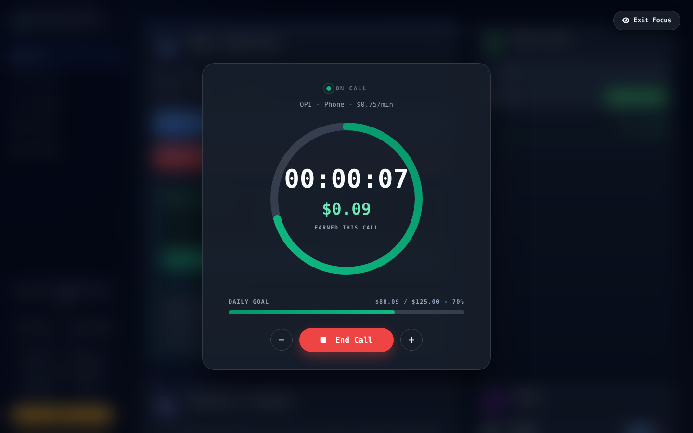 |

### Call Log — your history

Every saved call in one place: filter by date range, search, and edit entries. Import a company CSV history or export your own — with preview, column mapping, and dedupe before anything is saved.

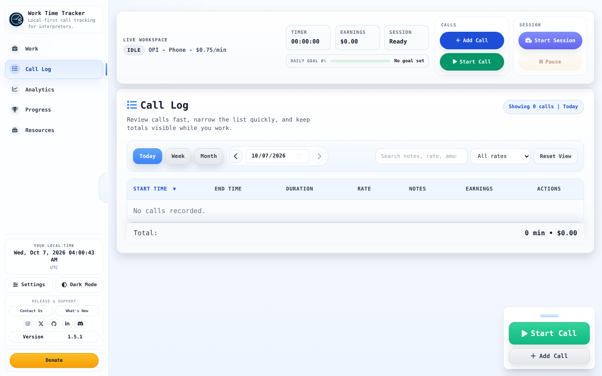

### Analytics — your patterns

Daily earnings, average call duration, and hourly, weekly, and monthly patterns, plus payment-cycle snapshots so you know what to invoice.

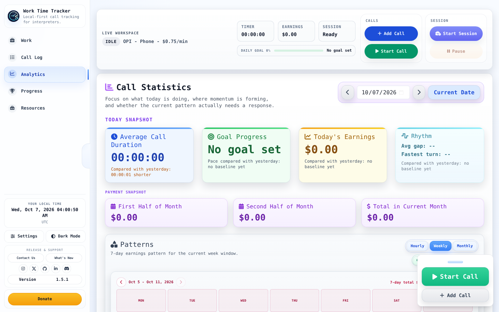

### Progress — your consistency

Achievements, XP, streaks, and quests keep consistency visible over time. Progress is stored locally, right next to the calls that earned it.

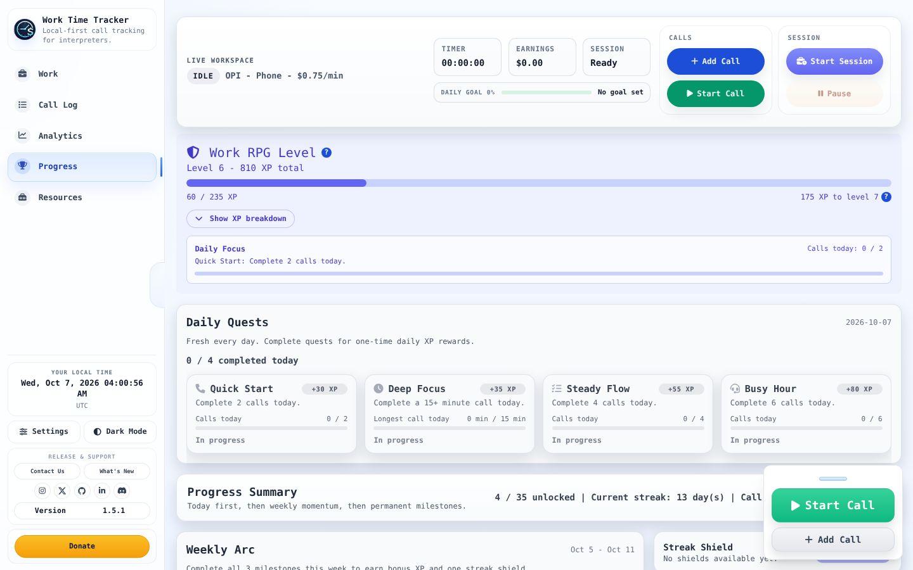

### Resources — your support tools

Two interpreter support tools built into the workspace:

- **US ZIP / Address Lookup** — one-bar search for ZIPs, cities, states, and partial addresses, with ranked matches and recent lookups
- **Interpreter Language Assistant** — multilingual term lookup with ranked translation candidates, related terms, and frequent searches

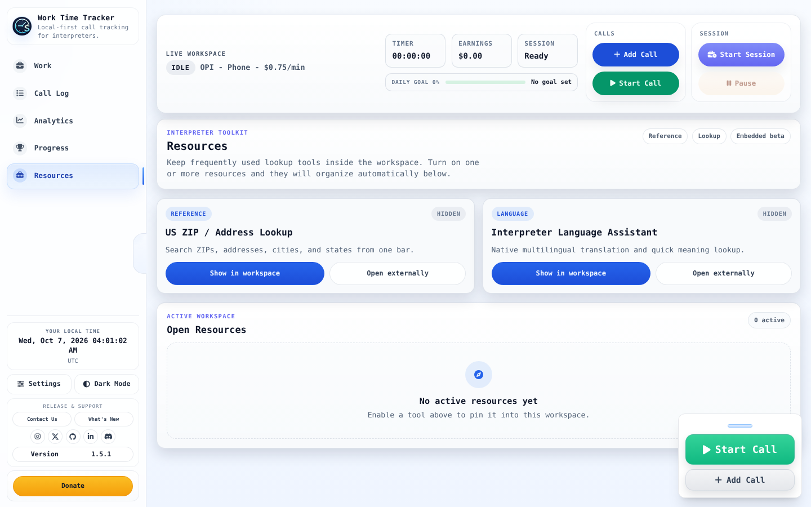

### Light and dark

The whole app adapts to your theme. Same data, same tools, whatever is easier on your eyes at the end of a shift.

| Light | Dark |
|:---:|:---:|
| 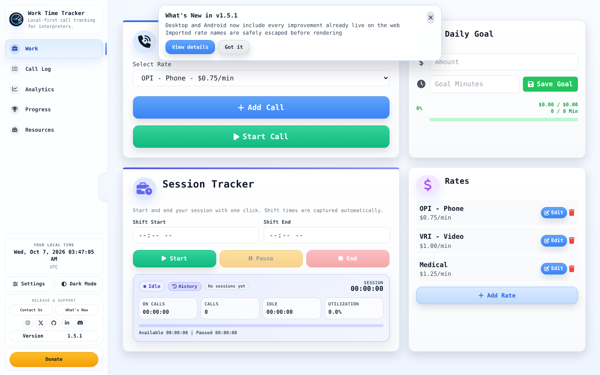 | 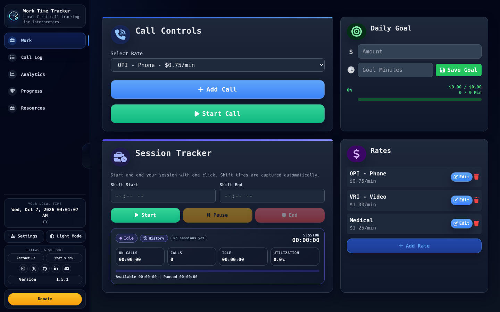 |

### On mobile

Responsive layouts for desktop, tablet, and mobile — including floating call controls, so you can start and end calls without losing your place.

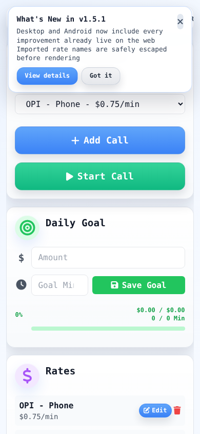

---

## Why It Exists

- Track paid calls and earnings without spreadsheets
- Keep work data local and simple
- Stay fast during live interpreting work
- Combine tracking and support tools in one workspace

It is built for interpreters who bill by duration, freelancers tracking time-based income, and anyone who wants a private tool with no account setup.

## Core Features

- Live call timer with real-time earnings
- Optional Focus Mode during live calls
- Manual call entry and editing
- Multiple billing rates
- Daily goal tracking in USD and minutes
- Session tracking with utilization metrics
- Call Log filtering and CSV import/export
- JSON backup export/import
- Payment cycle tracking
- Floating call controls
- Dark/light mode
- In-app changelog
- Responsive layouts for desktop, tablet, and mobile

## Data and Privacy

Your work data never leaves your device.

- Calls, rates, goals, sessions, payment cycles, and progress are stored locally
- No accounts, no login, no cloud sync
- No backend owns your tracking data
- Backups only move data when you explicitly export or import a file
- Volatile notes are intentionally not persisted or exported

### What Leaves Your Device

Some optional parts of the app do talk to the internet. Nothing below ever sends
your calls, earnings, rates, or history.

| Feature | Destination | What is sent | How to avoid it |
|---|---|---|---|
| Usage analytics (web only) | GoatCounter (`gc.zgo.at`) | Anonymous page-view ping. No app data | Use the desktop or Android build |
| Update check | `untopo.github.io`, `api.github.com` | Nothing. Only reads the published version | Ignore the banner |
| US ZIP / Address Lookup | `api.zippopotam.us`, `nominatim.openstreetmap.org` | The ZIP or address you type | Do not use the tool |
| Interpreter Language Assistant | `api.mymemory.translated.net`, `api.dictionaryapi.dev`, `api.datamuse.com` | The term you look up | Do not use the tool |
| Contact Us form | `formspree.io` | What you write in the form | Email instead |

Styles and icons are self-hosted: loading the app does not contact any CDN.

If you interpret under confidentiality rules, treat the Resources tools like any
other third-party lookup: the term you search is sent to the provider above.

### Analytics

The web version at GitHub Pages loads GoatCounter for anonymous page-view
counts. It records no personal data, no work data, and no cross-site profile.

- The desktop (Tauri) and Android (Capacitor) builds skip analytics entirely
- There is no in-app opt-out toggle yet; a browser content blocker stops it today
- Self-hosted copies can remove the analytics call from `assets/js/app.js`

## Backup and Restore

- Backup and restore live in `Settings -> Data Management`
- `Export Backup JSON` includes app data such as calls, rates, goals, and payment cycles
- `Export Call Log CSV` exports call rows only
- Imports are reviewed before saving
- Exact duplicates are skipped during merge/import flows

## Platforms

One version of the app, three ways to run it:

| Platform | Technology | Notes |
|---|---|---|
| Web | Static files | Runs from the project root; works on GitHub Pages |
| Desktop | Tauri | Native file dialogs for import/export; no analytics |
| Android | Capacitor | Responsive mobile/tablet layouts; no analytics |

All three share the same frontend and release-version syncing.

## Quick Start

```bash
git clone https://github.com/untopo/work-time-tracker.git
cd work-time-tracker
```

Open `index.html` directly for the web version, or use the build commands below for packaged targets.

## Build Commands

### Web

```bash
npm run build:web
```

### Desktop

```bash
npm run tauri:dev
npm run tauri:build
```

### Android

```bash
npm run cap:sync
npm run cap:sync:android
npm run cap:open:android
```

To produce a signed Android release, copy `android/keystore.properties.example` to `android/keystore.properties` and fill in your keystore values, or provide the same values through these environment variables:

- `WTT_ANDROID_KEYSTORE_FILE`
- `WTT_ANDROID_KEYSTORE_PASSWORD`
- `WTT_ANDROID_KEY_ALIAS`
- `WTT_ANDROID_KEY_PASSWORD`

Then build from Android Studio or run:

```bash
cd android
gradlew assembleRelease
```

## Tech Stack

- Vanilla JavaScript
- HTML and CSS
- Tauri for desktop packaging
- Capacitor for Android packaging

## Project Structure

```text
/
|-- index.html
|-- package.json
|-- capacitor.config.json
|-- scripts/
|-- android/
|-- src-tauri/
|-- assets/
|   |-- css/
|   |   `-- styles.css
|   |-- js/
|   |   |-- app.js
|   |   |-- resources-data.js
|   |   |-- resources-helpers.js
|   |   |-- settings-manager.js
|   |   |-- storage.js
|   |   |-- update-utils.js
|   |   `-- update-manager.js
|   `-- images/
|-- docs/
|   `-- screenshots/
|-- README.md
`-- .nojekyll
```

## FAQ

### Where is my data stored?
In local app/browser storage for this project.

### Can I sync data across devices?
Not automatically. Use JSON export/import manually.

### What is the Resources section for?
It is an in-app workspace for interpreter support tools that stay available alongside the rest of the app.

### Can I import a company call history CSV?
Yes. The app supports preview, column mapping, dedupe, and optional rate handling before import.

### Why did my data disappear?
Most likely the underlying browser/site/app storage was cleared.

## Limitations

- No automatic multi-device sync
- No cloud recovery
- Local storage capacity depends on the environment
- Clearing site/app storage can remove saved data

## Browser Support

Recommended on current:

- Chrome
- Edge
- Firefox

Safari generally works, but import/export behavior should always be verified in your environment.

## Contributing

1. Fork the repo and create a branch.
2. Keep changes focused.
3. Preserve local-first behavior and data integrity.
4. Include manual test notes in your PR.

## Releases

- Current Version: `v1.5.1`
- In-app history: `What's New` modal
- GitHub Releases: https://github.com/untopo/work-time-tracker/releases
- Full markdown changelog: [`CHANGELOG.md`](CHANGELOG.md)
- Release workflow: [`RELEASE.md`](RELEASE.md)

## Community

Join the Discord server for interpreters using the app. It is the fastest place
to ask questions, share workflows, and hear about releases first.

- Discord: https://discord.gg/eRayqAkFWC
- X: https://x.com/worktimetracker
- LinkedIn: https://www.linkedin.com/company/work-time-tracker/
- GitHub: https://github.com/untopo/work-time-tracker

All of these are also available in the app sidebar.

## Support the Project

The app is free and has no paid tier. If it saves you time, you can help cover
development and release costs:

- PayPal: https://www.paypal.com/donate/?hosted_button_id=3YPGH7MTRMFTJ
- Ko-fi: https://ko-fi.com/untopo

## Feedback

Use the in-app `Contact Us` modal for:

- bug reports
- feature requests
- general feedback

Direct contact reference: `worktimetrackertool@gmail.com`

## Credits

Built for interpreters by interpreters.

Made by [Topo](https://www.instagram.com/otpo/)
