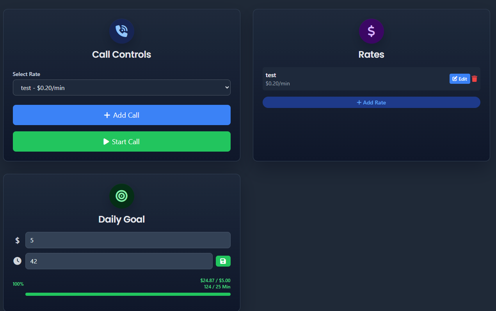
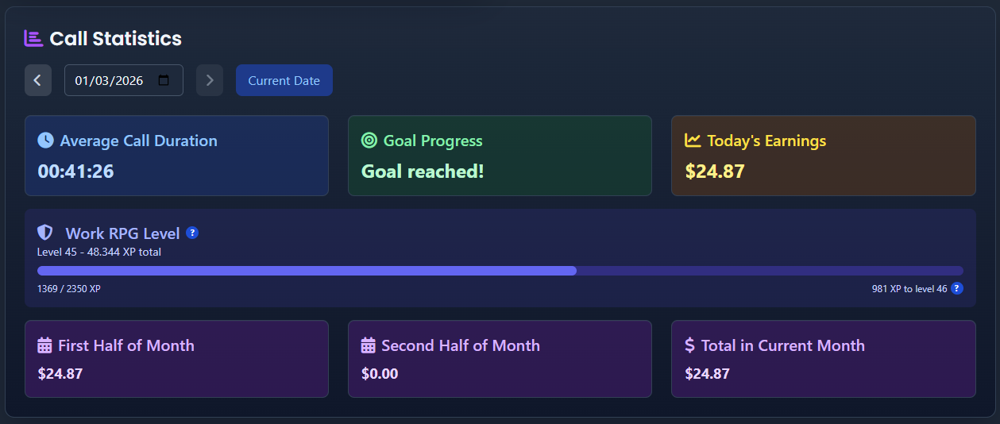
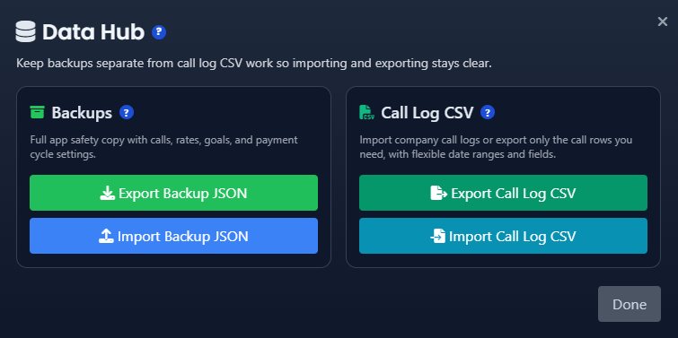
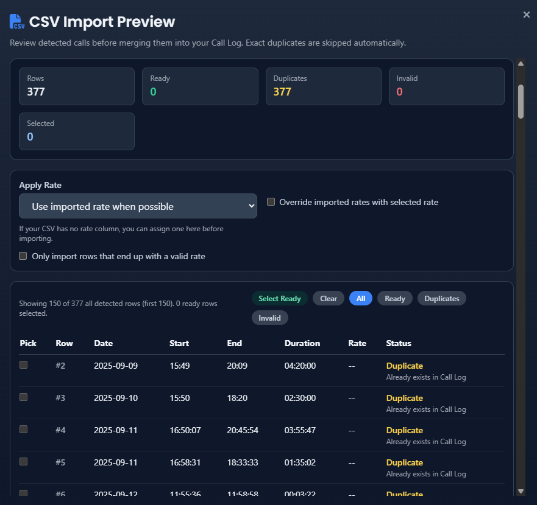
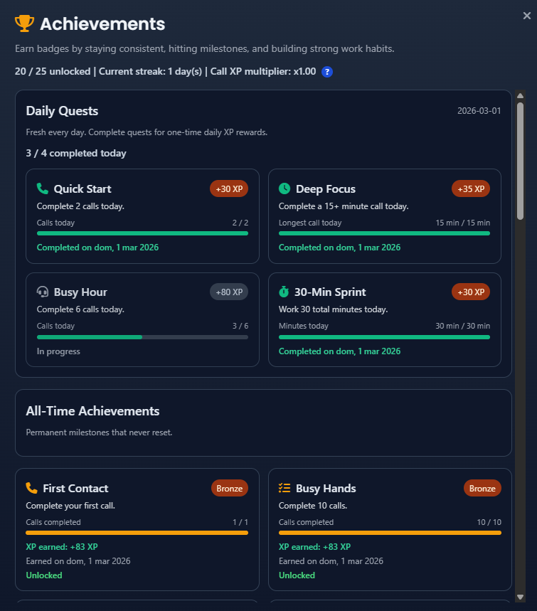

# Work Time Tracker


A local-first call, earnings, and workflow tracker built for interpreters.

Work Time Tracker helps you run live calls, log manual work, track rates and goals, review patterns, manage sessions, and use interpreter support tools without depending on accounts or cloud sync.

## Live Demo
- https://untopo.github.io/work-time-tracker/

## Why It Exists
- Track paid calls and earnings without spreadsheets
- Keep work data local and simple
- Stay fast during live interpreting work
- Combine tracking and support tools in one workspace

## Who It Is For
- Interpreters who bill by duration
- Freelancers tracking time-based income
- Users who want a private tool with no account setup

## Product Areas
### Work
- Start and end live calls
- See real-time timer and earnings
- Manage rates and daily goals
- Run work sessions with pause/resume

### Call Log
- Review saved calls
- Filter by date ranges
- Search and edit entries
- Import/export call history

### Analytics
- Review daily earnings and average call duration
- See hourly, weekly, and monthly patterns
- Track payment-cycle snapshots

### Progress
- View achievements, XP, streaks, and quests
- Keep consistency visible over time

### Resources
- `US ZIP / Address Lookup`
- `Interpreter Language Assistant`

### Settings
- Toggle optional features
- Manage time zone, storage, and backups
- Access data tools and support actions

## Core Features
- Live call timer with real-time earnings
- Manual call entry and editing
- Multiple billing rates
- Daily goal tracking in USD and minutes
- Session tracking with utilization metrics
- Call Log filtering and CSV import/export
- JSON backup export/import
- Payment cycle tracking
- Floating call controls
- Dark/light mode
- In-app changelog
- Responsive layouts for desktop, tablet, and mobile

## Interpreter Support Tools
### US ZIP / Address Lookup
- One-bar search for ZIPs, cities, states, and partial addresses
- Fast suggestions and ranked address matches
- Recent lookups stored locally

### Interpreter Language Assistant
- Multilingual term lookup
- Ranked translation candidates
- Quick meaning support when available
- Related terms and frequent searches

## Screenshots
### Dashboard Top


### Dashboard Stats


### Data Hub


### CSV Import Preview


### Achievements


## Data and Privacy
Your work data never leaves your device.

- Calls, rates, goals, sessions, payment cycles, and progress are stored locally
- No accounts, no login, no cloud sync
- No backend owns your tracking data
- Backups only move data when you explicitly export or import a file
- Volatile notes are intentionally not persisted/exported

### What Leaves Your Device
Some optional parts of the app do talk to the internet. Nothing below ever sends
your calls, earnings, rates, or history.

| Feature | Destination | What is sent | How to avoid it |
|---|---|---|---|
| Usage analytics (web only) | GoatCounter (`gc.zgo.at`) | Anonymous page-view ping. No app data | Use the desktop or Android build |
| Update check | `untopo.github.io`, `api.github.com` | Nothing. Only reads the published version | Ignore the banner |
| US ZIP / Address Lookup | `api.zippopotam.us`, `nominatim.openstreetmap.org` | The ZIP or address you type | Do not use the tool |
| Interpreter Language Assistant | `api.mymemory.translated.net`, `api.dictionaryapi.dev`, `api.datamuse.com` | The term you look up | Do not use the tool |
| Contact Us form | `formspree.io` | What you write in the form | Email instead |
| Styles and icons | `cdn.tailwindcss.com`, `cdnjs.cloudflare.com` | Standard web request on load | Self-host the assets |

If you interpret under confidentiality rules, treat the Resources tools like any
other third-party lookup: the term you search is sent to the provider above.

### Analytics
The web version at GitHub Pages loads GoatCounter for anonymous page-view
counts. It records no personal data, no work data, and no cross-site profile.

- The desktop (Tauri) and Android (Capacitor) builds skip analytics entirely
- There is no in-app opt-out toggle yet; a browser content blocker stops it today
- Self-hosted copies can remove the analytics call from `assets/js/app.js`

## Backup and Restore
- Backup and restore live in `Settings -> Data Management`
- `Export Backup JSON` includes app data such as calls, rates, goals, and payment cycles
- `Export Call Log CSV` exports call rows only
- Imports are reviewed before saving
- Exact duplicates are skipped during merge/import flows

## Platforms
### Web
- Runs directly from the project root
- Compatible with GitHub Pages

### Desktop
- Built with Tauri from the same shared frontend
- Uses generated `dist/` output
- Supports native file dialogs for import/export
- Shares release-version syncing with web and Android

### Android
- Built with Capacitor from the same shared frontend
- Uses generated `dist/` output
- Includes responsive mobile/tablet layouts and update awareness

## Quick Start
```bash
git clone https://github.com/untopo/work-time-tracker.git
cd work-time-tracker
```

Open `index.html` directly for the web version, or use the build commands below for packaged targets.

## Build Commands
### Web
```bash
npm run build:web
```

### Desktop
```bash
npm run tauri:dev
npm run tauri:build
```

### Android
```bash
npm run cap:sync
npm run cap:sync:android
npm run cap:open:android
```

To produce a signed Android release, copy `android/keystore.properties.example` to `android/keystore.properties` and fill in your keystore values, or provide the same values through these environment variables:

- `WTT_ANDROID_KEYSTORE_FILE`
- `WTT_ANDROID_KEYSTORE_PASSWORD`
- `WTT_ANDROID_KEY_ALIAS`
- `WTT_ANDROID_KEY_PASSWORD`

Then build from Android Studio or run:

```bash
cd android
gradlew assembleRelease
```

## Tech Stack
- Vanilla JavaScript
- HTML and CSS
- Tauri for desktop packaging
- Capacitor for Android packaging

## Project Structure
```text
/
|-- index.html
|-- package.json
|-- capacitor.config.json
|-- scripts/
|-- android/
|-- src-tauri/
|-- assets/
|   |-- css/
|   |   `-- styles.css
|   |-- js/
|   |   |-- app.js
|   |   |-- resources-data.js
|   |   |-- resources-helpers.js
|   |   |-- settings-manager.js
|   |   |-- storage.js
|   |   |-- update-utils.js
|   |   `-- update-manager.js
|   `-- images/
|-- README.md
`-- .nojekyll
```

## FAQ
### Where is my data stored?
In local app/browser storage for this project.

### Can I sync data across devices?
Not automatically. Use JSON export/import manually.

### What is the Resources section for?
It is an in-app workspace for interpreter support tools that stay available alongside the rest of the app.

### Can I import a company call history CSV?
Yes. The app supports preview, column mapping, dedupe, and optional rate handling before import.

### Why did my data disappear?
Most likely the underlying browser/site/app storage was cleared.

## Limitations
- No automatic multi-device sync
- No cloud recovery
- Local storage capacity depends on the environment
- Clearing site/app storage can remove saved data

## Browser Support
Recommended on current:
- Chrome
- Edge
- Firefox

Safari generally works, but import/export behavior should always be verified in your environment.

## Contributing
1. Fork the repo and create a branch.
2. Keep changes focused.
3. Preserve local-first behavior and data integrity.
4. Include manual test notes in your PR.

## Releases
- Current Version: `v1.5.0`
- In-app history: `What's New` modal
- GitHub Releases: https://github.com/untopo/work-time-tracker/releases
- Full markdown changelog: [`CHANGELOG.md`](CHANGELOG.md)
- Release workflow: [`RELEASE.md`](RELEASE.md)

## Community
Join the Discord server for interpreters using the app. It is the fastest place
to ask questions, share workflows, and hear about releases first.

- Discord: https://discord.gg/eRayqAkFWC
- X: https://x.com/worktimetracker
- LinkedIn: https://www.linkedin.com/company/work-time-tracker/
- GitHub: https://github.com/untopo/work-time-tracker

All of these are also available in the app sidebar.

## Support the Project
The app is free and has no paid tier. If it saves you time, you can help cover
development and release costs:

- PayPal: https://www.paypal.com/donate/?hosted_button_id=3YPGH7MTRMFTJ
- Ko-fi: https://ko-fi.com/untopo

## Feedback
Use the in-app `Contact Us` modal for:
- bug reports
- feature requests
- general feedback

Direct contact reference: `worktimetrackertool@gmail.com`

## Credits
Built for interpreters by interpreters.

Made by [Topo](https://www.instagram.com/otpo/)
